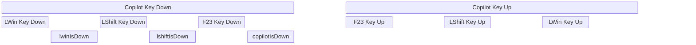
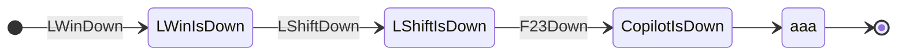
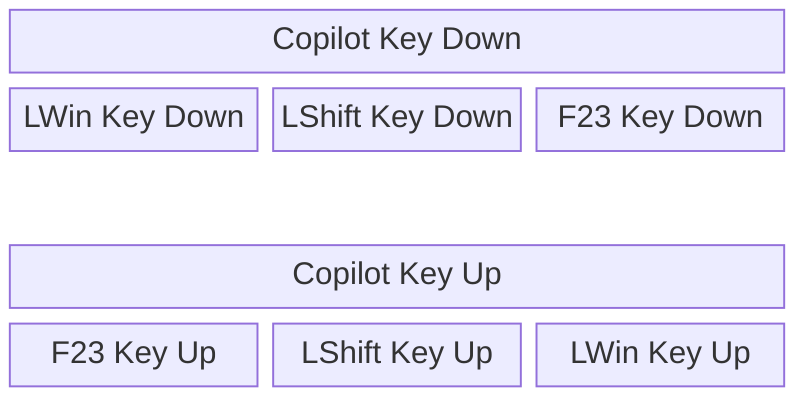

# Copilot Key Remap – Sequence Ideation

## Background - Event Sequence

When the user presses the Copilot key, Windows generates a sequence of key events:

 

| Turn | Event | lwinIsDown | lshiftIsDown | copilotIsDown |
|---:|---|:---:|:---:|:---:|
| 0 | Initial (idle) | ⭕ | ⭕ | ⭕ |
| 1 | LWin Key Down | ✅ | ⭕ | ⭕ |
| 2 | LShift Key Down | ✅ | ✅ | ⭕ |
| 3 | F23 Key Down | ✅ | ✅ | ✅ |
| 4 | F23 Key Up | ✅ | ✅ | ⭕ |
| 5 | LShift Key Up | ✅ | ⭕ | ⭕ |
| 6 | LWin Key Up | ⭕ | ⭕ | ⭕ |

 
 
 

 
 
 
 
 

1. `lshift + lctrl + rightarrow` -> select word  
2. `lshift + copilot + rightarrow` -> select word  
3. `rshift + lctrl + rightarrow` -> select word  
4. `rshift + copilot + rightarrow` -> select word  
5. `lctrl + lshift + rightarrow` -> select word  
7. `lctrl + rshift + rightarrow` -> select word  
8. `copilot + rshift + rightarrow` -> select word  
9. `a` -> `a`  
10. `lshift + a` -> `A`  
11. `rshift + a` -> `A`  
12. `copilot + rightarrow` -> move cursor one word right  
13. `lctrl + rightarrow` -> move cursor one word right

